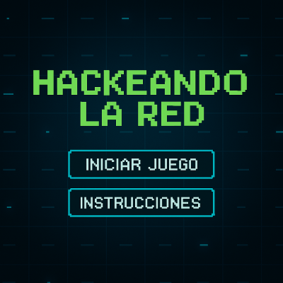

# Hackeando la red

## Equipo de desarrollo

- Juan
- Caro
- Nico
- Thomas

## Capturas

## Reglas de Juego / Instrucciones

## 🎯 Objetivo

Controlás a un **hacker** que debe navegar por la "**red**" para **robar todos los archivos secretos** antes de que los enemigos te atrapen.
Una vez que se recolectan todos los archivos, se abre la **puerta de enlace** que permite pasar al **siguiente nivel**.

---
## Personajes:

## 🧑‍💻 El Hacker

- Se puede mover en las cuatro direcciones (arriba, abajo, izquierda, derecha).
- Comienza con una cierta cantidad de **energía**.
- Si un enemigo lo alcanza, **recibe daño**.
- Puede recolectar **archivos** y **power-ups**.
- El juego reinicia el nivel si la energía del hacker llega a **0**.
---
## 👾 Los Enemigos

- Se mueven de forma **aleatoria** por el tablero.
- Cada enemigo infringe una cantidad de **daño** diferente si colisionan con el hacker.

  
---
## 📁 Elementos del Tablero

### Archivos secretos
- Ítems que el hacker debe recolectar.
- Una vez recolectados **todos**, se habilita la **puerta de enlace** al siguiente nivel.

### Power-ups
Objetos especiales que otorgan ventajas al hacker:

- **🧲 Imán de Archivos**: permite atraer automáticamente archivos cercanos.
- **🛡️ Armadura**: protege al hacker del daño por 10 segundos.

### 🚪 Puerta de enlace
- Solo se habilita cuando ya no quedan archivos por recoletar.
- Permite avanzar al siguiente nivel, donde aumenta poco a poco la dificultad.

---
## Información
- Universidad Nacional de Hurlingham
- Wollok ver 0.3.1
